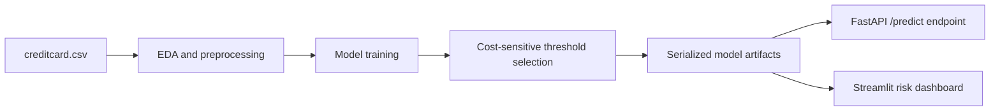

# Real-Time Fraud Detection System

## Problem Statement

This project asks:

> Can we build a real-time machine learning system that accurately identifies fraudulent transactions while minimising financial loss from false decisions under extreme class imbalance?

The system trains supervised and unsupervised fraud models, compares them with imbalance-aware metrics, selects a business threshold using false-positive and false-negative costs, and exposes the selected model through a FastAPI service.

## Dataset

Main dataset: Credit Card Fraud Detection Dataset, the European cardholder transaction dataset commonly distributed through Kaggle.

- Around 284,000 transactions
- Fraud rate around 0.17%
- PCA-transformed features `V1` to `V28`, plus `Time`, `Amount`, and `Class`

Download `creditcard.csv` and place it here:

```text
data/raw/creditcard.csv
```

The raw dataset is not committed because it is externally distributed and relatively large.

## Architecture



## Models

The training pipeline compares:

- Logistic Regression with class weighting
- Random Forest with balanced subsampling
- XGBoost with `scale_pos_weight`
- Isolation Forest as an unsupervised anomaly detection baseline

The default production model is XGBoost because it is a strong fit for tabular fraud scoring and supports imbalance-aware training.

## Evaluation

Accuracy is intentionally not the headline metric because fraud is extremely imbalanced. The project reports:

- Precision
- Recall
- F1-score
- PR-AUC
- ROC-AUC
- Confusion matrix counts
- Business cost at the selected threshold

## Cost-Sensitive Decision Layer

The decision threshold is selected by minimizing:

```text
total_cost = false_positives * investigation_cost + false_negatives * fraud_loss
```

Default assumptions:

- False positive cost: 25
- False negative cost: 2500

These values can be changed in `src/fraud_detection/config.py`.

## Setup

```bash
python3 -m pip install -r requirements.txt
export PYTHONPATH=src
```

## Train Models

```bash
python -m fraud_detection.train --data-path data/raw/creditcard.csv
```

Training writes:

```text
models/fraud_xgboost.joblib
models/threshold.joblib
models/metrics.json
```

## Run API

```bash
export PYTHONPATH=src
python3 -m uvicorn api.main:app --reload
```

Example request:

```bash
curl -X POST "http://127.0.0.1:8000/predict" \
  -H "Content-Type: application/json" \
  -d '{
    "features": {
      "Time": 0,
      "V1": -1.359807,
      "V2": -0.072781,
      "V3": 2.536347,
      "V4": 1.378155,
      "V5": -0.338321,
      "V6": 0.462388,
      "V7": 0.239599,
      "V8": 0.098698,
      "V9": 0.363787,
      "V10": 0.090794,
      "V11": -0.5516,
      "V12": -0.617801,
      "V13": -0.99139,
      "V14": -0.311169,
      "V15": 1.468177,
      "V16": -0.470401,
      "V17": 0.207971,
      "V18": 0.025791,
      "V19": 0.403993,
      "V20": 0.251412,
      "V21": -0.018307,
      "V22": 0.277838,
      "V23": -0.110474,
      "V24": 0.066928,
      "V25": 0.128539,
      "V26": -0.189115,
      "V27": 0.133558,
      "V28": -0.021053,
      "Amount": 149.62
    }
  }'
```

Example response:

```json
{
  "fraud_probability": 0.031,
  "threshold": 0.21,
  "is_fraud": false,
  "risk_category": "low"
}
```

## Run Dashboard

```bash
export PYTHONPATH=src
python3 -m streamlit run streamlit_app/app.py
```

Upload a CSV containing the same feature columns used during training. The app ranks transactions by fraud probability and lets you adjust the decision threshold.

## Suggested Notebook Flow

Create `notebooks/Fraud_detection.ipynb` with:

1. Data loading and class imbalance analysis
2. Fraud vs legitimate transaction EDA
3. Stratified train/test split
4. Model comparison
5. PR-AUC, ROC-AUC, recall, precision, confusion matrices
6. Cost-sensitive threshold curve
7. Feature importance and optional SHAP analysis
8. Error analysis and deployment notes

## Portfolio Summary

I built an end-to-end fraud detection system that identifies suspicious transactions in real time using XGBoost and anomaly detection methods. The system is trained on highly imbalanced financial data, optimized using PR-AUC and cost-sensitive threshold tuning, and deployed via a FastAPI service for real-time inference.
